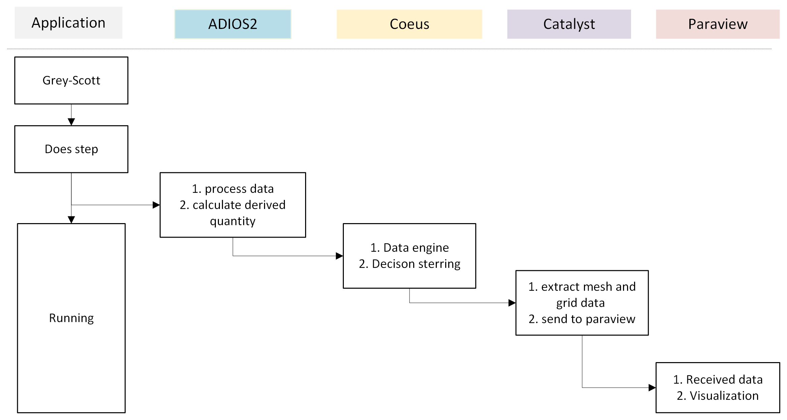

## Workflow Description

The following workflow describes the data flow and processing steps from the application (Grey-Scott) through ADIOS2, Coeus, Catalyst, and finally to Paraview for visualization:

1. **Application (Grey-Scott)**
	- The simulation application (Grey-Scott) performs a computational step.
	- After each step, it continues running and also outputs data for further processing.

2. **ADIOS2**
	- The output data from the application is processed.
	- Derived quantities are calculated as needed.

3. **Coeus**
	- Acts as a data engine and performs decision steering based on the processed data.

4. **Catalyst**
	- Extracts mesh and grid data from the results.
	- Sends the prepared data to Paraview for visualization.

5. **Paraview**
	- Receives the data from Catalyst.
	- Performs visualization of the simulation results.

This workflow enables in situ data processing and visualization, allowing for real-time feedback and decision making during simulation runs.

---

